# UI Style Skills

A collection of opinionated UI aesthetic skills for AI coding agents. Each skill is a complete design system — color tokens, typography, component patterns, layout rules, anti-patterns, and accessibility guidelines — that an AI agent can read and immediately apply to build web interfaces in a specific visual style.

**These are not component libraries.** They're design system *documents* that teach an AI how to think in a particular aesthetic. Feed one to Claude, GPT, or any code-generating model, and it'll build pages that look like they belong.

## The Styles

### ASCII Dither
Character density as visual language. Organic shapes rendered through ASCII characters at varying densities — `░▒▓█`. The dithering IS the design itself. Dark backgrounds, amber/green accents, monospaced everything.

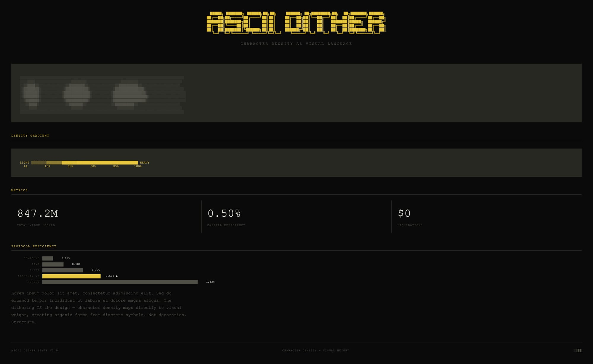

---

### ASCII Type
Text rendered as fields of ASCII characters on dark backgrounds. A bitmap font engine that rasterizes text through a 6×8 grid, mapping each cell to density-weighted character pools. Configurable color palettes (warm amber, phosphor green, cool blue — any color works), CRT scanlines, ambient drift, and glitch pulses.

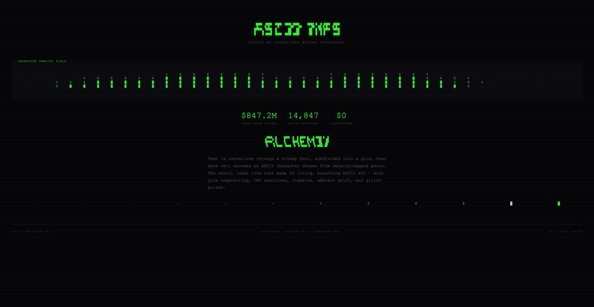

---

### Blueprint UI
Technical schematic / engineering blueprint aesthetic. Cyan lines on dark navy, circuit diagram patterns, grid-paper overlays, precise geometric construction, annotation callouts, dimension lines.

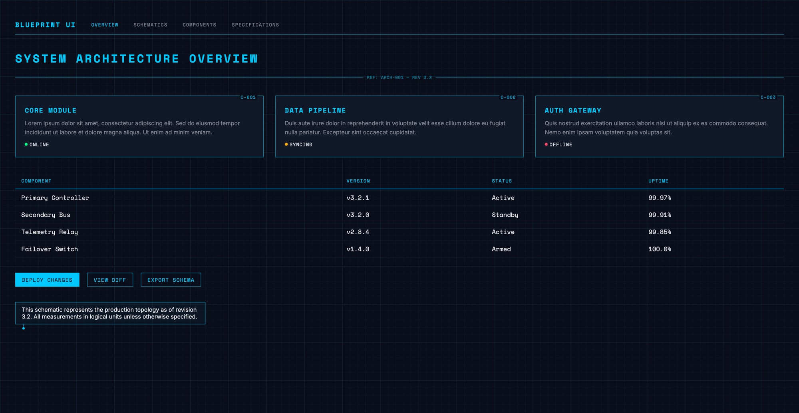

---

### Folio UI
Warm editorial technical folio. Parchment paper, high-contrast serif headlines, diagonal stripe section dividers, grid-line card layouts. The aesthetic of a beautifully typeset engineering manual on warm cotton paper.

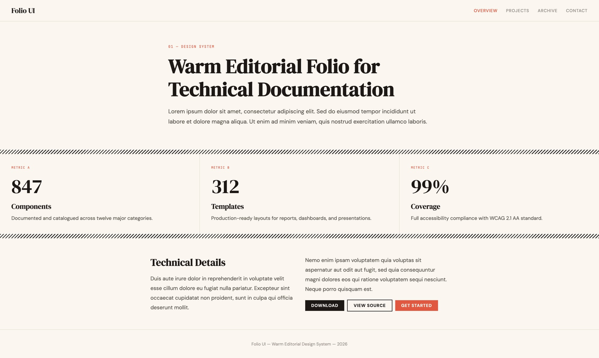

---

### Graffiti UI
Neon street art maximalism. Explosive cyan, magenta, acid yellow on dark backgrounds. Paint splatters, drip effects, sticker labels, spray-paint gradients. Anti-minimal. Maximum energy.

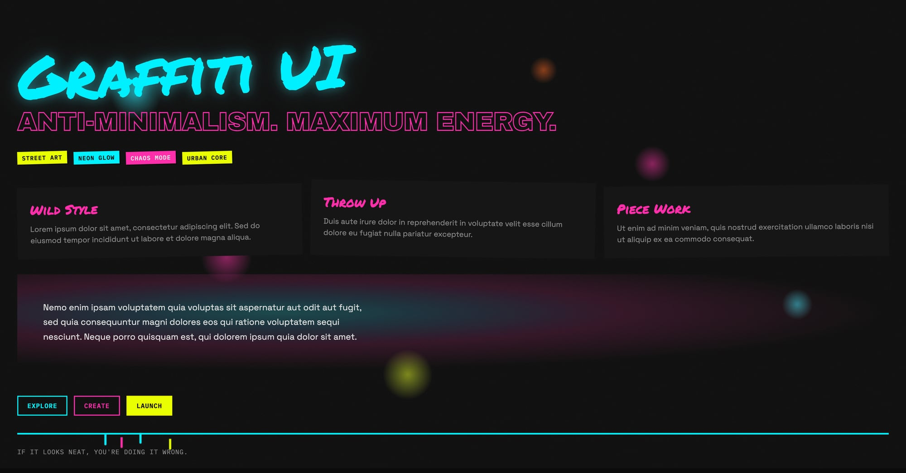

---

### LaTeX Style
Academic paper aesthetic for web pages. Computer Modern / Latin Modern typography, theorem environments, numbered sections, justified text, booktabs tables. The distinctive scholarly typographic rhythm of a properly typeset research paper.

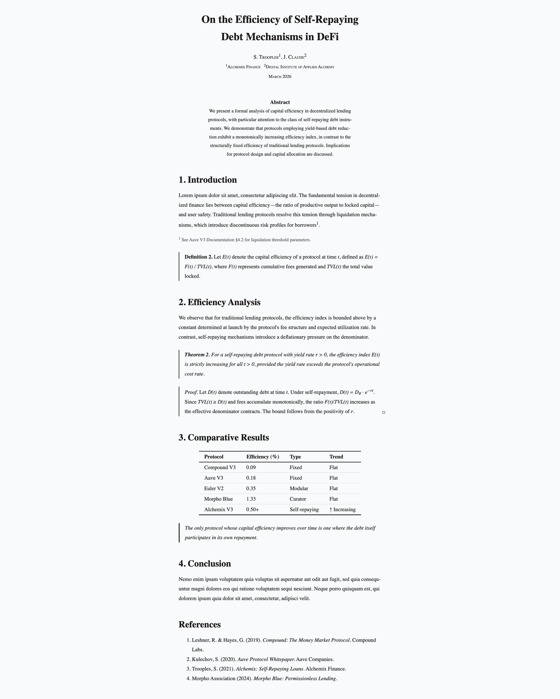

---

### NERV UI
Evangelion-inspired operations console. Black void backgrounds, sparse high-contrast color coding (orange headers, green data, cyan wireframes, red alerts), dense monospaced readouts, CRT scanline overlays, escalating alert states, bilingual JP/EN institutional labeling.

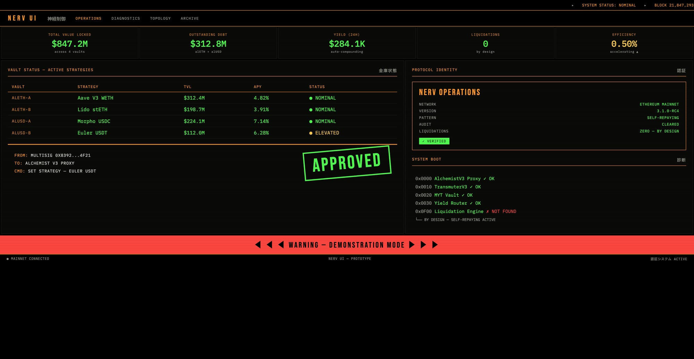

---

### Retro VHS UI
1970s–80s industrial manufacturing label / VHS tape packaging. Ultra-condensed bold sans-serif, strict black + white + vermillion 3-color system, diagonal stripes, dot grids, dense modular layouts, registration marks, oversized background typography.

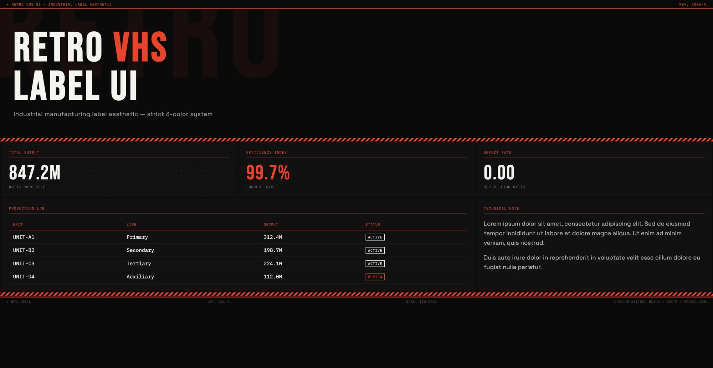

---

### Specimen UI
Vintage typography specimen / letterpress aesthetic. Mixed type styles across eras (blackletter, wood type, modern sans, script), specimen sheet layouts, ink-on-paper texture, print registration marks, glyph showcases, and 500 years of printing history. Dark or cream backgrounds with type as the primary visual element.

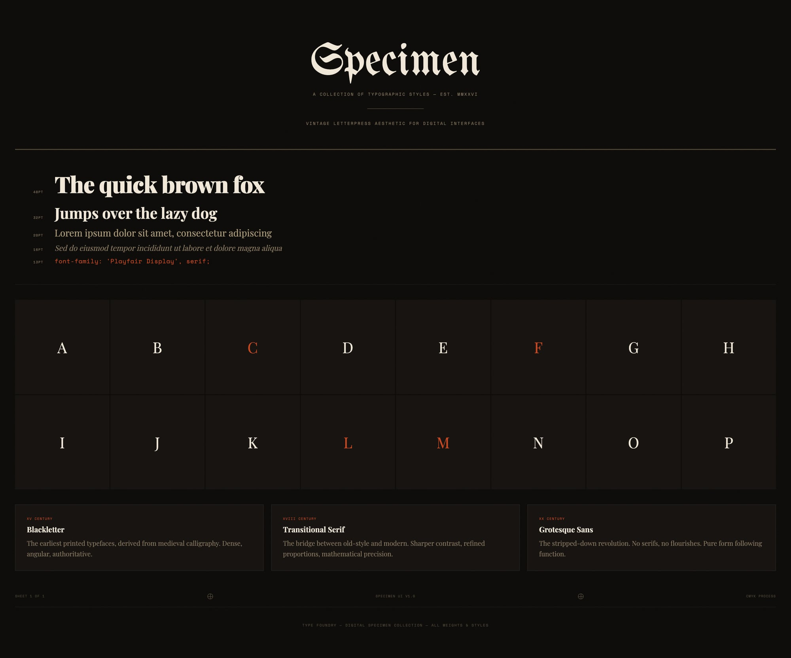

---

### Synth UI
Dark modular synthesizer aesthetic. Near-black backgrounds, teal/green accent lighting, knob and slider UI metaphors, LED indicator dots, patch cable connections, oscilloscope waveforms, VU meters, dense control panel layouts. Inspired by Eurorack and vintage audio equipment.

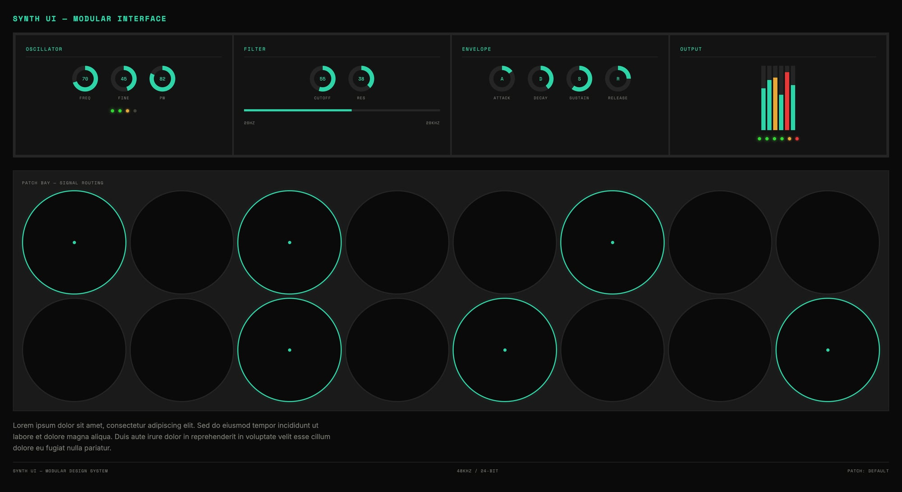

---

### Visual Explainer
Clean dark technical documentation style. Dark slate backgrounds, colored badge system (blue/green/amber/red), flow diagrams, code blocks with syntax highlighting, metric cards, comparison tables. The "explain a system visually" workhorse.

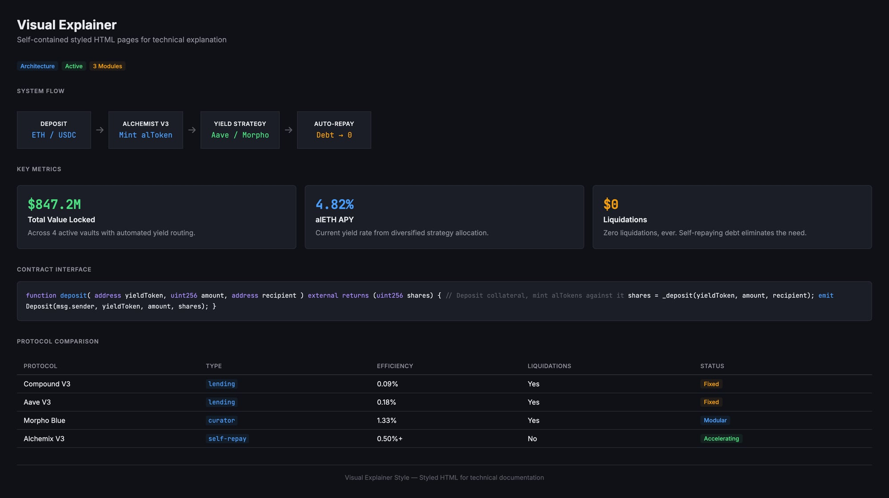

---

### Voxel Type
GPU-rendered voxelized typography. Text as dense grids of nested-square cells with directional lighting, edge dithering, bloom post-processing, and glitch corruption. Three.js + custom shaders + EffectComposer. Kinetic mosaic typography.

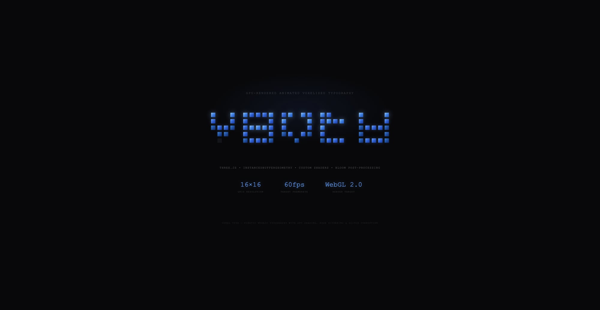

---

### Western UI
Old Western textbook aesthetic. Warm parchment backgrounds, calligraphic serif typography with tight display tracking, amber accent, canvas/linen texture overlays, zero border-radius, generous whitespace. 19th century surveyor's manual elegance.

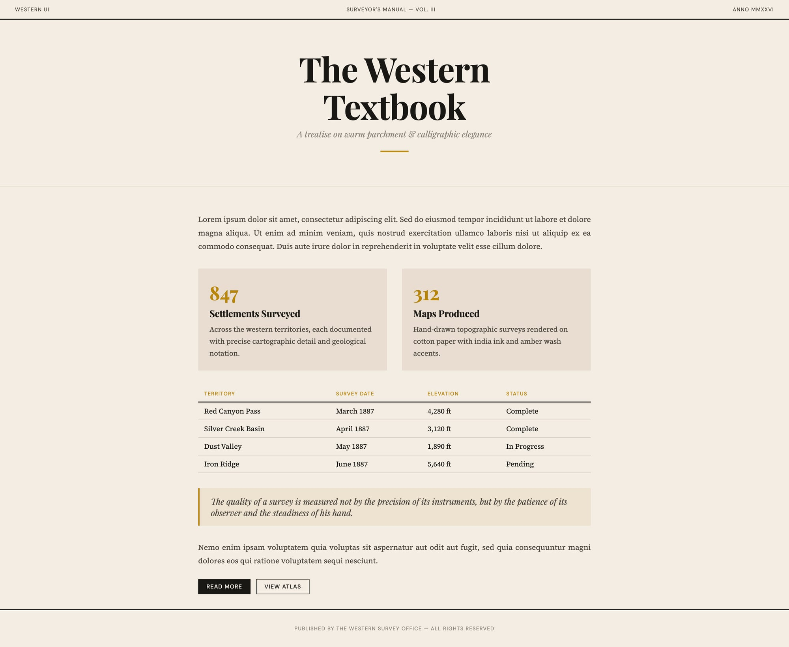

---

## How to Use

Each skill lives in `skills/<name>/SKILL.md`. To use one:

1. **Copy the SKILL.md** into your AI agent's context (system prompt, skill file, or paste directly)
2. **Ask the agent to build** — "Build me a dashboard using the NERV UI style"
3. **The agent reads the design tokens, patterns, and rules** and generates CSS/HTML that follows the aesthetic

These work with any AI coding tool — Claude Code, Cursor, Copilot, Windsurf, OpenClaw, or raw API calls. The skill file IS the design system.

### With OpenClaw

Drop the skill folder into `~/.openclaw/skills/` and it'll be auto-discovered:

```bash
cp -r skills/nerv-ui ~/.openclaw/skills/
```

### With Claude Code

Paste the SKILL.md contents into your CLAUDE.md or reference it in your system prompt.

### With Any AI

Just include the SKILL.md text in your prompt context. The design tokens, component CSS, and rules are all self-contained.

## What's Inside Each Skill

Every SKILL.md contains:

- **Design Tokens** — CSS custom properties for colors, typography, spacing
- **Typography** — Font stacks, scale, weights, letter-spacing rules
- **Patterns** — Background textures, grid systems, decorative elements
- **Components** — Cards, tables, buttons, navigation, status indicators
- **Layout** — Grid structures, composition rules
- **Anti-Patterns** — What NOT to do (equally important)
- **Accessibility** — Contrast ratios, motion preferences, colorblind considerations

## Philosophy

Most "design systems" are component libraries. These are **aesthetic DNA** — the rules, constraints, and visual language that make a style coherent. An AI that reads one of these files understands not just *what* to build, but *why* certain choices work and others don't.

The anti-patterns section is often more valuable than the patterns. Knowing that Blueprint UI never uses rounded corners, or that Graffiti UI never aligns anything perfectly, is what prevents the AI from defaulting to generic SaaS templates.

## License

MIT — use however you want.

## Credits

Built by [@scupytrooples](https://twitter.com/scupytrooples) and [Jean](https://github.com/alchemix-finance) at [Alchemix](https://alchemix.fi).
